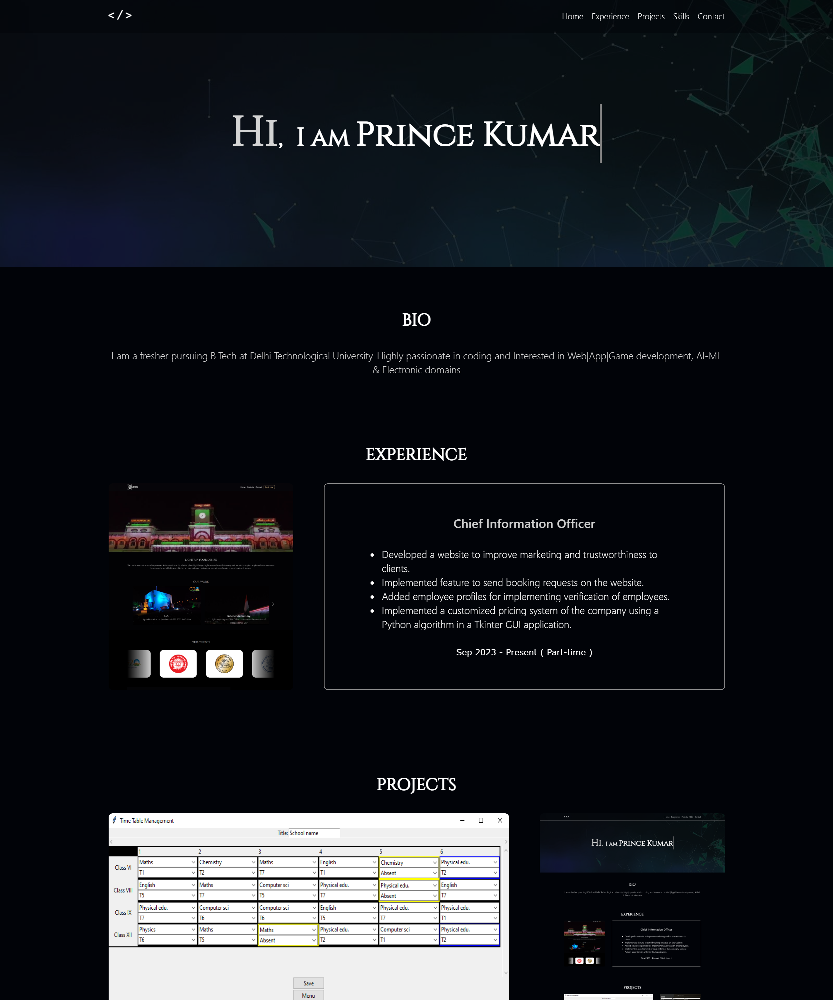

<h2 align="center">
  Portfolio Website 
</h2>
<h3 align="center">
  <a href="https://princekdev.github.io/portfolio" target="_blank">princekdev.github.io/portfolio</a>
</h3>

  

 

 &nbsp;
 &nbsp;
 &nbsp;

<h3 align="center">
    🔹
    <a href="https://github.com/princekdev/Portfolio/issues">Report Bug</a> &nbsp; &nbsp;
    🔹
    <a href="https://github.com/princekdev/Portfolio/issues">Request Feature</a>
</h3>

## Built With

My personal portfolio <a href="https://princekdev.github.io/portfolio/" target="_blank">princekdev.github.io/portfolio/</a> which features some of my github projects as well as my resume and technical skills. 

This project was built using these technologies.

- HTML5
- CSS3
- VsCode

## Features

**🔨 Made with raw Html and Css**

**📄 Single-Page Layout**

**🎨 Styled with Css**

**📱 Fully Responsive**

## Getting Started

Clone down this repository. You will just need `git` installed on your machine.

### Show your support

Give a ⭐ if you like this website!
